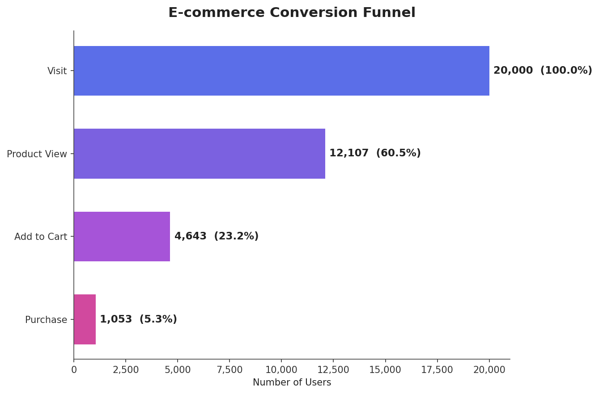
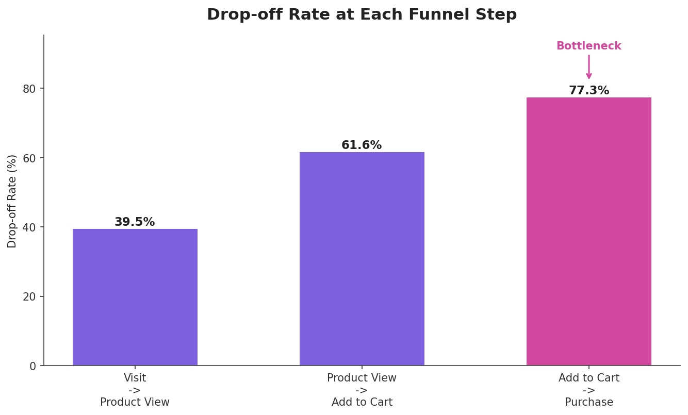
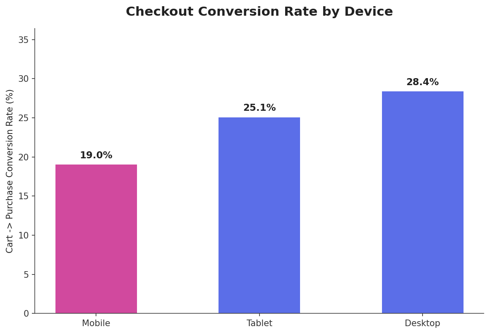
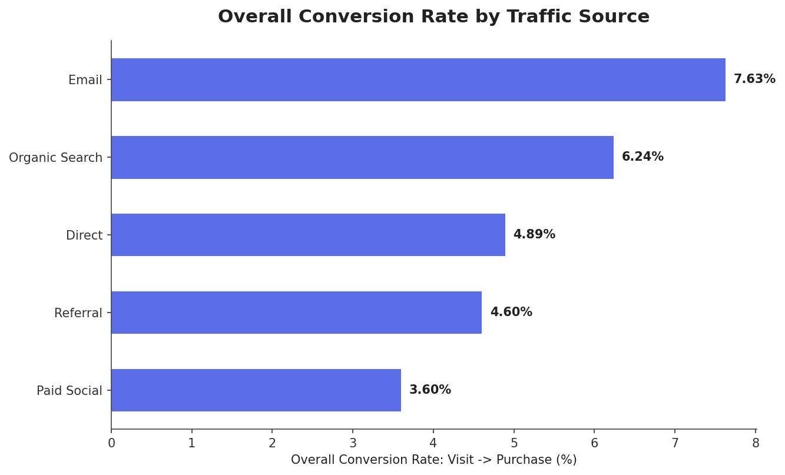

# 🛒 E-Commerce Conversion Funnel Analysis

<p align="center">

</p>

## SyntecXHub Data Analysis Internship 

---

# 📌 Project Overview

Understanding customer behavior throughout the purchasing journey is one of the most important challenges in modern e-commerce. Although websites may attract thousands of visitors every day, only a small percentage eventually complete a purchase.

This project performs a complete **E-Commerce Conversion Funnel Analysis** to understand customer progression through the sales funnel, identify where users abandon the process, determine conversion rates, and provide actionable recommendations to improve business performance.

The analysis was conducted on a dataset containing **20,000 user sessions**, segmented by **traffic source** and **device type**.

---

# 🎯 Objectives

The main objectives of this project are:

* Define customer journey stages
* Measure conversion rates between stages
* Analyze drop-off percentages
* Identify funnel bottlenecks
* Study checkout behavior by device
* Compare marketing channel effectiveness
* Suggest improvements to increase sales

---

# 🏢 Business Problem

An online retailer receives substantial traffic from multiple acquisition channels, including:

* Email Marketing
* Organic Search
* Direct Traffic
* Referral Campaigns
* Paid Social Media

Despite attracting a large number of visitors, the company experiences poor purchase completion rates.

Management wants to understand:

* Where customers leave the funnel
* Which devices struggle during checkout
* Which marketing channels generate high-quality visitors
* How to increase overall conversion rate

---

# 🏗 Funnel Definition

The purchasing journey consists of four sequential stages.

| Stage        | Description                         |
| ------------ | ----------------------------------- |
| Visit        | User lands on website               |
| Product View | User views at least one product     |
| Add to Cart  | User adds item to shopping cart     |
| Purchase     | User successfully completes payment |

---

# 📂 Dataset Information

Dataset Size

**20,000 sessions**

Features

```text
visit

product_view

add_to_cart

purchase

device

traffic_source
```

---

# ⚙️ Technology Stack

| Category           | Technologies |
| ------------------ | ------------ |
| Language           | Python 3     |
| Data Processing    | Pandas       |
| Numerical Analysis | NumPy        |
| Visualization      | Matplotlib   |
| Data Storage       | CSV          |
| Reporting          | DOCX         |
| IDE                | VS Code      |
| Version Control    | Git          |
| Repository Hosting | GitHub       |

---

# 📁 Project Structure

```bash

Ecommerce_Funnel_Analysis/

│

├── ecommerce_funnel_data.csv

├── drop_off_analysis.csv

├── conversion_rates.csv

├── device_bottleneck.csv

├── traffic_source_performance.csv


│

├── chart1_funnel_overview.png

├── chart2_dropoff_rates.png

├── chart3_device_conversion.png

├── chart4_traffic_source_conversion.png


│

├── funnel_analysis.py


│

├── Ecommerce_Funnel_Analysis_Report.docx


│

└── README.md


```

---

# 📚 Required Libraries

```python

import pandas as pd

import numpy as np

import matplotlib.pyplot as plt

import matplotlib.ticker as mticker


```

Install dependencies

```bash

pip install pandas

pip install matplotlib

pip install numpy


```

---

# 🔄 Load Dataset

```python

df = pd.read_csv("ecommerce_funnel_data.csv")


```

---

# 🚀 Defining Funnel Stages

```python

STAGES=[

"visit",

"product_view",

"add_to_cart",

"purchase"

]


STAGE_LABELS=[

"Visit",

"Product View",

"Add to Cart",

"Purchase"

]

```

---

# 📊 Funnel Overview Analysis

```python


overall_counts = df[STAGES].sum()


print(overall_counts)


```

Output

```text

Visit            20,000

Product View     12,107

Add To Cart       4,643

Purchase          1,053


```

---

## Funnel Summary

| Funnel Stage | Users  | % Initial Visitors |
| ------------ | ------ | ------------------ |
| Visit        | 20,000 | 100%               |
| Product View | 12,107 | 60.5%              |
| Add To Cart  | 4,643  | 23.2%              |
| Purchase     | 1,053  | 5.3%               |

---

# 📈 Funnel Visualization

<p align="center">


</p>

### Insights

Only **5.3%** of all visitors complete purchases.

Most users leave before reaching checkout.

---

# 📉 Drop-Off Analysis

Conversion Formula

```text


Drop Off %


Dropped Users
------------------- ×100
Users Entering


```

Python Implementation

```python


drop_off=[]


for i in range(len(STAGES)-1):


 current=overall_counts[STAGES[i]]

 nxt=overall_counts[STAGES[i+1]]


 dropped=current-nxt


 drop_pct=(dropped/current)*100


 drop_off.append({


"drop_off_rate_pct":round(drop_pct,2)


})


```

---

# Drop-Off Results

| Funnel Step                | Drop-Off |
| -------------------------- | -------- |
| Visit → Product View       | 39.5%    |
| Product View → Add to Cart | 61.6%    |
| Add to Cart → Purchase     | 77.3%    |

---

<p align="center">



</p>

---

# 📊 Conversion Rate Analysis

Formula

```text

Conversion Rate


Users Continuing

--------------------- ×100

Users Entering


```

Python

```python


conversion=[]


for i in range(len(STAGES)-1):


 current=overall_counts[STAGES[i]]

 nxt=overall_counts[STAGES[i+1]]


 conv_pct=(nxt/current)*100


 conversion.append({


"conversion_rate_pct":round(conv_pct,2)


})


```

---

## Conversion Results

| Step                       | Conversion |
| -------------------------- | ---------- |
| Visit → Product View       | 60.5%      |
| Product View → Add to Cart | 38.4%      |
| Add to Cart → Purchase     | 22.7%      |

---

# 🚨 Bottleneck Identification

The most significant leakage occurs during

## Add To Cart → Purchase

Users Entering

```text
4,643
```

Users Purchasing

```text
1,053
```

Users Lost

```text
3,590
```

Drop-Off

```text
77.3%
```

This stage is identified as the primary bottleneck in the customer journey.

---

# 📱 Device Performance Analysis

Python Code

```python


device_bottleneck=df.groupby(

"device"

).apply(

lambda g:

pd.Series({


"conversion_pct":

(

g["purchase"].sum()

/

g["add_to_cart"].sum()

)*100


})

)


```

---

## Device Conversion Results

| Device  | Conversion |
| ------- | ---------- |
| Mobile  | 19.0%      |
| Tablet  | 25.1%      |
| Desktop | 28.4%      |

<p align="center">



</p>

### Findings

Desktop users perform best.

Mobile checkout performs worst.

Mobile users convert **33% less** than desktop users.

Possible reasons:

• Long forms

• Poor UX

• Payment friction

• Slow loading pages

---

# 🌐 Traffic Source Analysis

Python

```python


source_perf=df.groupby(

"traffic_source"

).apply(

lambda g:


pd.Series({


"overall_conversion_pct":

(

g["purchase"].sum()

/

g["visit"].sum()

)*100


})

)


```

---

# Channel Performance

| Source         | Conversion |
| -------------- | ---------- |
| Email          | 7.63%      |
| Organic Search | 6.24%      |
| Direct         | 4.89%      |
| Referral       | 4.60%      |
| Paid Social    | 3.60%      |

<p align="center">



</p>

---

# 🔍 Key Findings

### Overall Purchase Rate

Only **5.3%**

of visitors complete purchases.

---

### Largest Leakage

77.3%

of users abandon checkout.

---

### Mobile Problem

Mobile users have the weakest checkout experience.

---

### Best Marketing Channel

Email campaigns convert the highest.

---

### Weakest Channel

Paid Social generates traffic but poor buying intent.

---

# 💡 Recommendations

### Simplify Mobile Checkout

Reduce form fields

Enable autofill

UPI Integration

Google Pay

Apple Pay

---

### Recover Abandoned Carts

Email reminders

SMS notifications

Push campaigns

Guest checkout

---

### Build Customer Trust

Security badges

Money-back guarantee

Free shipping indicator

Return policies

---

### Improve Paid Social Campaigns

Retargeting

Purchase campaigns

Audience optimization

---

### Increase Budget for

✔ Email Campaigns

✔ Organic Search

---

### A/B Testing

Single Page Checkout

vs

Multi Step Checkout

---

# 🏁 Conclusion

Out of **20,000 visitors**, only **1,053 users completed purchases**, resulting in an overall conversion rate of **5.3%**.

The biggest opportunity for revenue improvement lies in optimizing the **Add To Cart → Purchase** stage, especially for **mobile users**.

By implementing streamlined checkout experiences, abandoned-cart recovery systems, and better marketing allocation, the company can significantly improve sales performance.

---

# 🧠 Skills Demonstrated

✔ Python

✔ Pandas

✔ NumPy

✔ Matplotlib

✔ Exploratory Data Analysis

✔ Funnel Analytics

✔ Business Intelligence

✔ Marketing Analytics

✔ Data Visualization

✔ Customer Journey Analysis

✔ Conversion Optimization

✔ Data Storytelling

---

## ⭐ Author

### JISMON GEORGE

**Data Analyst | AI/ML Engineer**

Kerala, India

GitHub : https://github.com/jismon-george

LinkedIn : [www.linkedin.com/in/jismon-george](http://www.linkedin.com/in/jismon-george)

---
